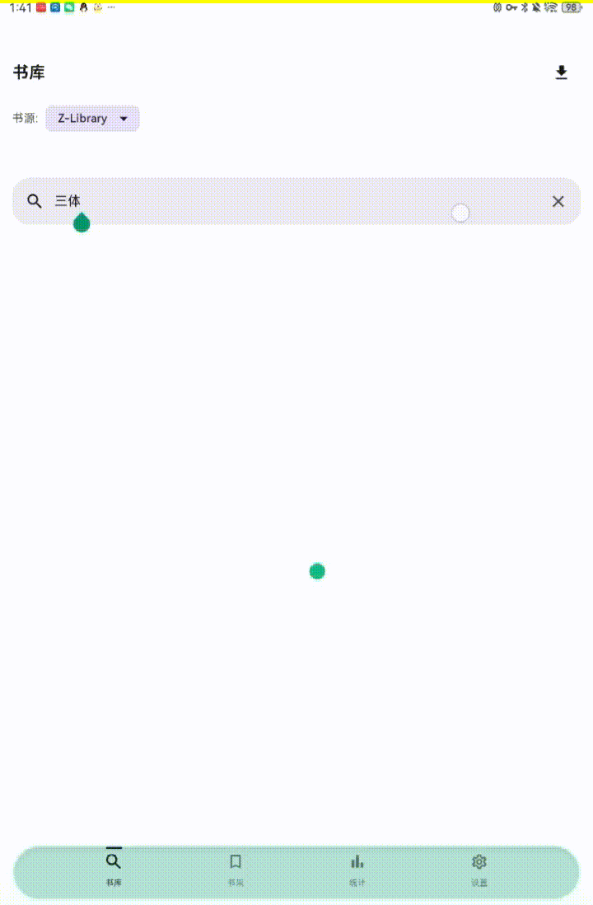
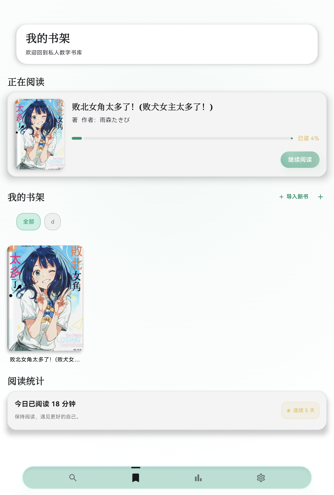
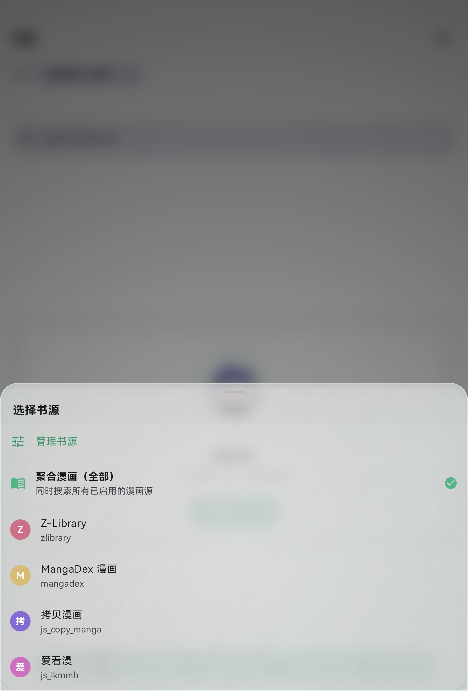
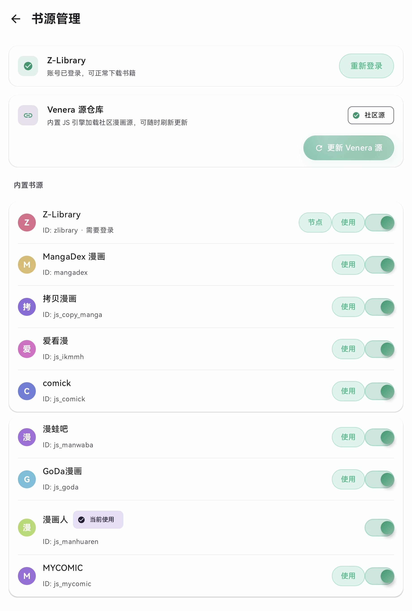
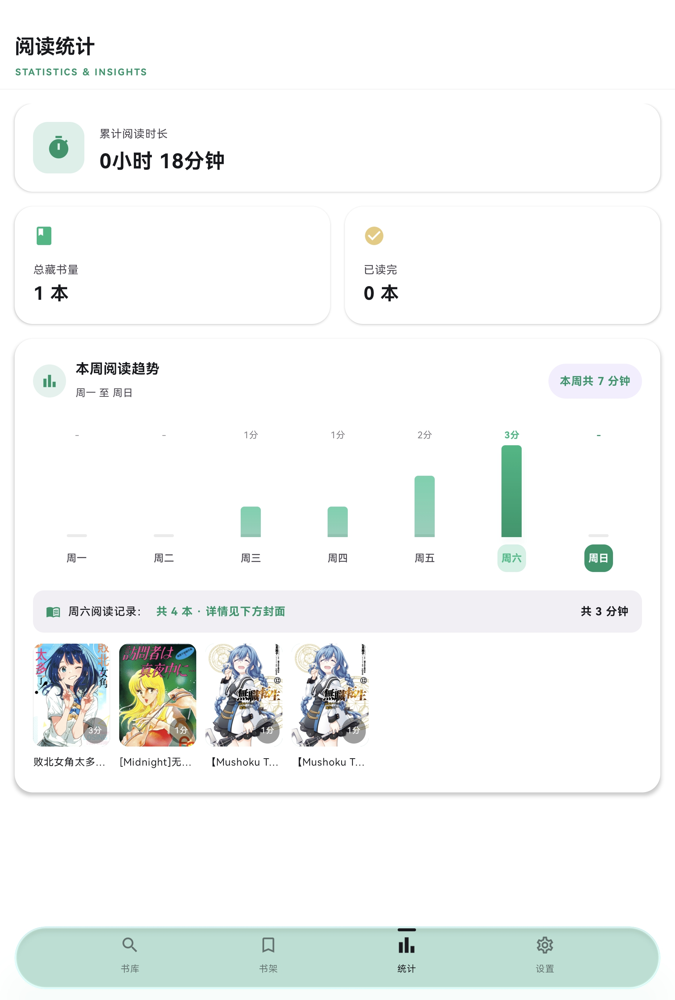
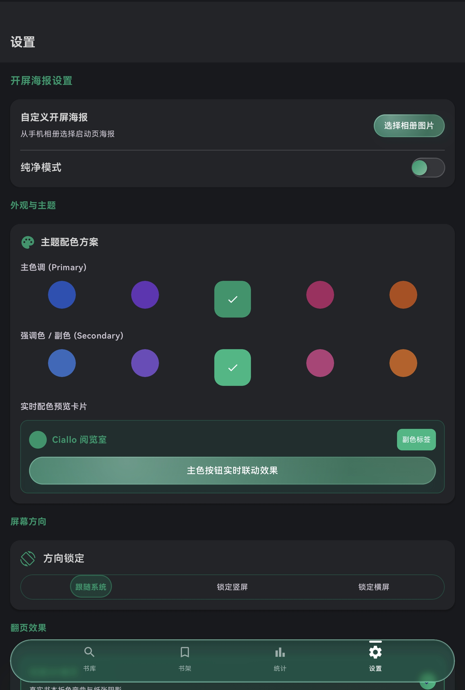

<div align="center">


# 📚 Ciallo阅读（EASYREADER）

### Modern Android Reader × Resource Downloader

一个基于 **Kotlin + Jetpack Compose** 打造的现代 Android 阅读器。

TXT / EPUB / 漫画阅读  
在线书库聚合搜索 · 资源下载 · 自定义书源 · LiquidGlass UI





[📲 下载 APK](https://github.com/a1553846342-dotcom/EASYREADER/releases) ·
[📖 功能介绍](#功能特性) ·
[🐛 提交 Issue](https://github.com/a1553846342-dotcom/EASYREADER/issues)


</div>

---

## 1. 📖 项目简介

市面上阅读器不少，但大多要么丑、要么卡、要么书源常年失效。Ciallo阅读 从立项那天起就只想做一件事：**把“好用”和“好看”同时做到位**，让打开阅读器这件事本身变成享受。

为什么做这个项目？因为我们受够了老牌阅读器“能用但难用”的体验——翻页像 PPT、设置页像十年前的后台、加个书源还要研究半天规则。于是我们选了 Kotlin + Jetpack Compose 从零重写，把每一帧动画、每一个弹窗、每一条数据流都按“现代应用”的标准做，而不是按“电子书工具”的标准做。

和同类软件有什么不同？**它不只是阅读器，更是一台资源下载器**：Z-Library 深度原生接入（自动过 DiamWall 验证、节点管理、账号登录、真实下载链接解析、EPUB/MOBI/PDF/AZW3/TXT/FB2 多格式下载），搜索到的书不是“只能看看”，而是直接下载到书架离线阅读；漫画支持单章/批量下载，下载中心常驻后台，断点续传、失败重试、真实格式校验一条龙。再加上 **Venera JS 漫画源生态**（拷贝漫画、comick、漫蛙吧、goDa 等开箱即用）、**自定义 JSON 书源**（兼容 Legado 规则）和**一整套液态玻璃设计语言**（悬浮收缩 Tab 栏、毛玻璃弹窗、果冻开关、Juno 滑块、凝胶按钮）。别人只做一个点，我们做了一整套。

目标用户是谁？受够了旧阅读器卡顿的深度书虫、每天追更的漫画党、喜欢折腾自定义书源的极客、需要批量下载离线资源的囤积党，以及单纯想找一个“打开就能安静看书”的普通人。

### 📋 项目基本信息

| 项目 | 内容 |
|---|---|
| 项目名称 | Ciallo阅读（EASYREADER） |
| 一句话简介 | 支持本地 TXT/EPUB/MOBI/AZW3/漫画导入、自定义书源、在线书库聚合搜索与多格式下载的安卓阅读器兼资源下载器 |
| 技术栈 | Kotlin 2.0 + Jetpack Compose（Material 3）+ MVVM + Room + WorkManager |
| 最低支持系统 | Android 7.0（API 24）+ |
| 当前版本 | 1.0.1 |
| 开发状态 | 个人项目 · 活跃开发中 |

---

## 2. ✨ 功能特性

<details open>
<summary>📚 书籍格式支持</summary>

| 格式 | 支持情况 | 说明 |
|---|---|---|
| TXT | ✅ 完整支持 | 大文件秒开、按体积分段、自动章节识别、GBK/UTF-8 自适应 |
| EPUB | ✅ 完整支持 | 解析 OPF/NCX，保留目录、封面、元数据 |
| MOBI / AZW3 / AZW | ✅ 完整支持 | PDB/KF8 双段解析、PalmDOC/HUFF-CDIC 解压、封面提取、DRM 检测占位提示 |
| CBZ / CBR | ✅ 完整支持 | ZIP/RAR 漫画容器解析，按页阅读 |
| PDF | ⚠️ 部分支持 | 漫画按页渲染；文本 PDF 暂以“暂不支持阅读”占位入库 |

</details>

<details open>
<summary>📖 阅读体验细节</summary>

- **翻页动画（五种）**：仿真 3D 卷页（真实折角、阴影、纸背反光）、覆盖翻页、平移翻页、渐变淡出、上下滚动。每种都针对“翻页出戏”这个痛点单独调过手感。
- **排版自由**：字号、行距、页边距、首行缩进全部可调；阅读主题内置白底/羊皮纸/夜间/护眼/纯黑五套；字体支持默认/衬线/黑体/等宽，并可导入 TTF 字体文件；「阅读排版」面板半透明浮层设计，调参时可实时对照书页效果。
- **FluidSlider 流体滑条全局统一**：Ramotion FluidSlider 风格——按下时白色气泡从轨道弹出（Overshoot 回弹）、metaball 液态连接、数值显示在气泡内；阅读器字号/行距/页边距/亮度、章节拖动、漫画页码、护眼强度等全部滑条统一为同一套 goo 风格，并经过手势仲裁（松手提交、标签淡出、连续滑动不中断）。
- **自动滚屏**：解放双手的沉浸阅读模式，60fps 平滑滚动；顶栏一键开启/关闭，底部浮停指示器点击停止；滚过 20% 后出现回顶悬浮按钮，点击平滑回顶；翻页模式切换时自动关闭，与 TTS 听书互斥。
- **卷页下拉书签**：仿真卷页模式下往下拉页面出现蓄力书签卡片，方向仲裁 + 阻尼回弹的手感调校，松手即收藏当前页；普通模式书签走顶栏，图标区分「加书签/书签列表」。
- **阅读器亮度与沉浸控制**：阅读排版面板内置亮度调光（实时预览，与系统亮度分离）；顶栏重设计为四个主按钮 + 溢出菜单（搜索/书签列表/自动滚屏/阅读排版），搜索、目录、批注入口常驻。
- **读完徽章**：一本书读到最后一章最后一页后，书架卡片自动挂上金色「已读完」标记；重开停在末页不会误触发庆祝动画。
- **目录自动定位**：打开章节目录自动跳转到当前阅读位置，千章大书秒定位。
- **护眼模式原理**：夜间模式走深色配色 + 降低屏幕亮度的刺眼感；护眼滤镜叠加暖色调色（0–65% 可调），配合流体滑条实时预览强度，长时间夜读不刺眼。
- **定时休息**：15/30/45/60 分钟预设或自定义任意时长，到点弹窗提醒，强制你离开屏幕歇眼睛。
- **TTS 朗读**：系统引擎无缝接入，边听边看；支持书签、划线高亮、全文搜索、进度自动保存。
- **阅读统计**：周/月/年周期总览、日历热力图（月/年视图）、阅读趋势图、高峰时段分布、连续打卡、每日阅读目标（±15 分钟自定义步进器）、阅读报告一键分享。

</details>

<details open>
<summary>🔍 书源管理</summary>

- **自定义规则书源**：支持粘贴 JSON / 导入文件，兼容 Legado 规则与 JSON API；网络导入社区书源合集。
- **书源导入导出**：JSON 格式标准化，社区分享即贴即用。
- **隐藏彩蛋**：设置页连按六下「主色按钮实时联动效果」，开启「带你登大郎~~~」后自动更新并显示成人漫画源。
- **搜索聚合逻辑**：逐源搜索、每出一个源立即展示，源与源之间用渐变毛玻璃胶囊分隔，失败显示“超时/无结果”而不是干等。
- **内置 Z-Library**：自动过 DiamWall 新版 PoW 验证；节点管理（默认节点、官网/备用入口扒取、自定义节点、一键检测）；账号/Cookie 登录后直接下载；支持 EPUB/MOBI/PDF/AZW3/TXT/FB2 多格式选择；每日下载额度用尽时给出明确提示，不再误报“HTML 错误页”。
- **内置 MangaDex 与 Venera 漫画源**：QuickJS 运行社区 JS 源，聚合搜索一次覆盖主流漫画站。

</details>

<details open>
<summary>⚡ 资源下载器</summary>

- **Z-Library 全链路下载**：搜索 → 详情 → 自动过 DiamWall 验证 → 解析真实下载链接 → 断点续传 → 文件校验 → 自动入库书架，全程无需浏览器；默认格式与用户选择的非默认格式（EPUB/MOBI/PDF/AZW3/TXT/FB2）分别走自研链路与 eapi 多格式链路。
- **漫画批量下载**：章节列表一键勾选，单章/批量任选；下载任务由应用级任务中心托管，**切页面、切 Tab、锁屏都不中断**。
- **3 路并发 + 暂停/继续/取消**：大章节下载速度明显提升；失败任务不会从列表消失，一键重试。
- **断点续传**：下载中断后从已下载字节继续，不重复拉取。
- **真实格式校验**：下载完成后按文件内容（魔数/编码）识别真实格式，不再被书源错误标签误导；HTML 错误页、每日限额页、DiamWall 验证页均能识别并给出明确中文提示；UTF-8/GBK/UTF-16 编码的 TXT 都能正确入库。
- **毛玻璃下载卡片**：实时显示封面、进度、速度、剩余大小；下载中/暂停/失败均提供暂停、继续、取消按钮；下载中心常驻，随时回来查看。
- **书架分享原文件**：长按书架书籍可分享 EPUB/漫画/MOBI/PDF/AZW3 原文件（零拷贝或临时缓存用完即焚），不会长期占用双份存储。
- **封面缓存**：下载入库时同步缓存封面，书架不再出现“无封面”占位。

</details>

<details open>
<summary>🗄️ 数据管理</summary>

- **阅读进度**：按书按章实时记录，重开即续。
- **书架管理**：分类、导入、移动、删除一键完成，封面自动抓取缓存；排序三态切换（默认/标题/最近阅读）；书籍卡片显示章节进度条（第 X/Y 章 + 进度指示）；分类支持长按删除（带确认对话框）；长按书籍呼出 Acrylic 半屏操作菜单，小屏上内容完整可达。
- **本地备份**：数据存于应用私有目录；WebDAV 云同步与 JSON 导出在 Roadmap 中。
- **存储管理**：可视化查看应用总占用（缓存 / 用户数据 / 书籍数据分区一目了然），一键清理缓存零风险；离线书籍、漫画、封面等用户数据独立分区，删除需二次确认且量化后果，下载进行中自动拦截。

</details>

<details open>
<summary>🎨 个性化设置</summary>

- **主题配色**：主色/强调色自由搭配，全软件颜色弹簧过渡，切换不重启。
- **屏幕方向**：跟随系统 / 锁定竖屏 / 锁定横屏，切换立即生效。
- **开屏海报**：自定义海报 + 纯净模式（直进软件，无任何开屏）。
- **软件背景**：默认主题色或自定义背景图，横竖屏自动裁剪铺满。
- **字体**：系统字体即用，阅读器内可直接导入 TTF 字体文件。
- **TTS 朗读**：语速、音量跟随系统，阅读器内一键开关。

</details>

<details open>
<summary>🌟 其他亮点</summary>

- **液态玻璃整套 UI**：悬浮收缩 Tab 栏（真实背景模糊 + 虹彩描边 + 自动对比色图标）、亚克力弹窗、果冻开关、凝胶按钮、ChasingDots 加载动画。
- **MAX 极光特效包**：「极致」渲染档专属——三色极光辉光流边、呼吸光晕、顶部高光跟随、内容层视差、入场弹簧动效；配合「自定义卡片参数」实时调参面板（折射/压痕/倾斜/光效逐项可调、立即生效）。标题文字颜色还会按自定义壁纸的明暗色调自动取对比色。
- **整卡 3D 视觉与物理反馈**：玻璃卡片像跷跷板一样随按压倾斜、随滚动手势惯性摆动并极软回正；配合固定光源的 AGSL 法线光照压痕（Android 13+，低版本自动降级为渐变模拟），整套 UI 有真实“玻璃厚度”。
- **吉祥物动画**：蓝发巫师少女 Roxy 五套姿态（待机/欢呼/奔跑/捧书/低落）按场景自动切换，配合呼吸、漂浮、弹跳、抖动等微动效，让 App 有点人情味。

</details>

---

## 3. 📸 应用截图 / 效果预览

| 书架主页 | 书库 · 选择书源 |
|---|---|
|  |  |

| 书源管理 | 阅读统计 | 设置页 |
|---|---|---|
|  |  |  |

---

## 4. 📲 安装方式

### ① Release / APK 直装（推荐）

1. 前往本仓库 **Releases** 下载 `app-release.apk`（约 8.1MB，arm64-v8a）。
2. 手机系统设置中允许「安装未知来源应用」。
3. 打开 APK 按提示安装；华为设备按系统流程确认风险提示即可。

### ② 源码自行编译

**环境要求**

- JDK 17+
- Android SDK（compileSdk 35 / minSdk 24 / targetSdk 35）
- 可访问 Google Maven / Maven Central 的网络

**构建步骤**

```bash
# 1. 克隆仓库（已内置 Gradle Wrapper，无需预装 Gradle）
git clone https://github.com/a1553846342-dotcom/EASYREADER.git
cd EASYREADER

# 2. 配置 SDK 路径（Windows / Linux / macOS 通用）
echo "sdk.dir=/你的/Android/Sdk/路径" > local.properties

# 3. 一键构建正式版 APK
./gradlew :app:assembleRelease
```

APK 输出路径：`app/build/outputs/apk/release/app-release.apk`

> 提示：`debug.keystore` 不会提交到仓库，首次构建会自动生成本地调试密钥；未配置签名环境变量时自动回退 debug 签名，clone 下来即可构建。正式分发请配置 `KEYSTORE_PATH / STORE_PASSWORD / KEY_PASSWORD`。

---

## 5. 🧭 使用教程

### 如何添加书源

1. 底部 Tab 进入「书库」。
2. 顶部书源选择器切换 Z-Library / MangaDex / 聚合漫画（全部）。
3. 需要更多漫画源：设置 → 书源管理 →「更新 Venera 源」，自动拉取社区源。
4. 想用自己的规则：书源管理 →「粘贴 JSON」或「导入 JSON 书源文件」，格式兼容 Legado。
5. 解锁成人源：设置页连按六下「主色按钮实时联动效果」，开启「带你登大郎~~~」后自动更新并显示特殊漫画源。

### 如何导入本地书籍

书架页点「+ 导入新书」→ 选择 TXT / EPUB / CBZ / CBR 文件，自动解析并入库，大文件也不卡。

### 如何配置阅读设置

阅读器内点屏幕中央呼出工具栏 →「阅读排版」：亮度、首行缩进、字号步进（A−/A+）、行距、页边距、五套主题预览卡、五种翻页模式都在同一面板，面板半透明设计可边调边对照书页；支持直接导入 TTF 字体文件。全局护眼强度、夜间模式、屏幕方向、渲染画质在设置页统一管理。

### Z-Library 登录与下载

书源管理 → Z-Library →「去登录」输入账号密码或粘贴 Cookie；登录后搜索 → 点「下载」，断点续传自动接管。

---

## 6. 🏗️ 项目架构

### 目录结构

```text
app/src/main/java/com/example/
├── MainActivity.kt          # 单 Activity 入口与导航
├── MainViewModel.kt          # 全局状态（主题/护眼/方向锁/导入）
├── data/                     # Room、TXT/EPUB/漫画解析、偏好、TTS
├── download/                 # WorkManager 下载队列、断点续传、文件校验
├── library/                  # 在线书库 UI、下载中心、漫画导入
├── source/                   # 书源插件体系、Z-Library 引擎、JSON 书源、Venera JS 引擎
│   ├── zlibrary/             # DiamWall PoW、节点管理、会话/Cookie、多布局解析
│   └── js/                   # QuickJS 运行时、JS 消息桥
├── ui/                       # Compose 界面
│   ├── components/           # 液态玻璃按钮/开关/Tab 栏、JunoSlider、分段选择器等
│   ├── pageturn/             # 五种翻页容器
│   ├── mascot/               # 吉祥物动画
│   └── source/               # 书源管理、节点管理、登录弹窗
├── liquidglass-core/         # LiquidGlass 核心（vendored）
├── liquidglass-compose/      # LiquidGlass Compose 封装（vendored）
└── backdrop/                 # KMPLiquidGlass backdrop（vendored）
```

### 核心模块说明

- **架构**：MVVM + StateFlow + Repository；单一 Activity + Navigation Compose。
- **存储管理**：应用内可视化存储统计（应用总占用 = 缓存/用户数据/书籍数据/其他精确分段），缓存一键清理零风险，离线数据删除需确认且下载进行中自动拦截。
- **书源体系**：所有书源统一实现 `BookSource` 接口，网络层由 OkHttp 拦截器链处理 DiamWall/Cloudflare 验证。
- **下载**：WorkManager 后台任务，任务状态实时广播，页面切换不中断。
- **渲染**：LiquidGlass + KMPLiquidGlass 提供真实背景采样与毛玻璃；`backdrop`/`liquidglass-*` 均为 vendored 源码，无需外部 Maven 私有仓库。

### 主要开源库及用途

| 库 | 用途 |
|---|---|
| Jetpack Compose / Material 3 | 整套 UI |
| Room + WorkManager | 持久化与后台下载 |
| OkHttp + Jsoup + Moshi | 网络、HTML 解析、序列化 |
| Coil | 图片加载与封面缓存 |
| QuickJS（quickjs-kt） | Venera JS 漫画源运行时 |
| Cronet | ehentai H@H 浏览器级网络栈 |
| Abdullajon1881/LiquidGlass | 液态玻璃渲染引擎 |
| KMPLiquidGlass | backdrop 捕获与毛玻璃 |
| FlexibleBottomSheet / compose-animations | 底部弹窗与形态动画 |

---

## 7. ❓ 常见问题 FAQ

**Q1：为什么搜索不到结果？**
先确认书源已启用且网络正常；Z-Library 需要自动过验证（等待数秒）；漫画源建议用「聚合漫画（全部）」一次搜索；也可切换节点或更换关键词。

**Q2：Z-Library 提示“需验证 / HTTP 503”怎么办？**
应用会自动解 DiamWall 新版 PoW；若遇到交互式验证，稍后重试或切换其他节点。浏览器能打开不代表 App 直连顺畅，请保持代理/VPN 状态一致。

**Q3：下载失败或校验失败？**
下载会自动重试并校验文件（防 HTML 假文件）。失败任务保留在下载中心，点重试即可；登录态过期请重新登录。

**Q4：如何备份数据？**
当前数据存于应用私有目录；JSON 导出与 WebDAV 云同步在 Roadmap 中，卸载前请先导出书籍文件。

**Q5：闪退怎么排查？**
请到 Issues 提供版本号、设备型号、复现步骤；Android 端可用 `adb logcat -b crash` 抓取崩溃栈一并附上。

**Q6：支持 iOS 吗？**
当前为纯 Android 项目；Compose Multiplatform 化已列入 Roadmap，iOS 包工程量不小但可行。

**Q7：自定义 JSON 书源怎么写？**
书库 → 帮助手册 →「查看 JSON 模板」；规则兼容 Legado 的 `@css:` / `@json:` 语法。

**Q8：APK 为什么只有 arm64？**
为把体积压到 8.1MB，Release 只打包 arm64-v8a（覆盖近三年主流设备）；模拟器请使用 Debug 包或自行调整 `abiFilters`。

---

## 8. 🗺️ Roadmap / 后续计划

- [x] MOBI / AZW3 / AZW 格式支持（已支持：正文解析、封面提取、DRM 检测）
- [x] 自定义字体包导入（阅读器「阅读排版」内直接导入 TTF）
- [ ] PDF 文本解析支持（当前 PDF 仅支持漫画按页渲染）
- [ ] 阅读记录 JSON 导出 / 导入
- [ ] WebDAV 云同步
- [ ] 音量键翻页、屏幕常亮快捷开关
- [ ] 电子墨水模式、全局手势自定义
- [ ] 更多内置漫画源与特殊漫画源连通性优化
- [ ] Compose Multiplatform（iOS 实验版）

---

## 9. 🤝 贡献指南

### 提 Issue

- 标题格式：`[模块] 问题描述`，如 `[书库] 搜索无结果`。
- 正文包含：版本号、设备型号、复现步骤、日志或截图。

### 提 PR

1. Fork 本仓库，从 `main` 拉分支，命名 `fix/xxx` 或 `feat/xxx`。
2. 代码风格：Kotlin + Compose；组件放 `ui/components`；书源实现 `BookSource` 接口。
3. 提交信息格式：`type: 描述`（如 `fix: zlib 下载 503`）。
4. 提交前跑通 `./gradlew :app:assembleRelease`。

---

## 10. ⚠️ 免责声明

本项目仅用于技术学习与交流。所有在线书源（含 Venera 社区源、Z-Library、MangaDex 等）均来自第三方，内容版权归原作者/出版社所有；请勿将本项目用于商业用途或传播侵权内容。因使用本软件产生的一切法律问题与作者无关。

---

## 11. 🙏 鸣谢

- 液态玻璃引擎：[Abdullajon1881/LiquidGlass](https://github.com/Abdullajon1881/LiquidGlass)、[Kashif-E/KMPLiquidGlass](https://github.com/Kashif-E/KMPLiquidGlass)
- 底部弹窗：[skydoves/FlexibleBottomSheet](https://github.com/skydoves/FlexibleBottomSheet)
- 动效参考：[skydoves/compose-animations](https://github.com/skydoves/compose-animations)、[commandiron/ComposeLoading](https://github.com/commandiron/ComposeLoading)
- 滑块交互：[christianselig/JunoSlider](https://github.com/christianselig/JunoSlider)
- 缩放组件：[usuiat/Zoomable](https://github.com/usuiat/Zoomable)
- 翻页参考：GitHub `pagecurl`、`PTQFlipper`
- Venera 漫画源：[venera-app/venera-configs](https://github.com/venera-app/venera-configs)
- ehentai 取图思路：[delta-comic/delta-comic-plugin-ehentai](https://github.com/delta-comic/delta-comic-plugin-ehentai)

---

## 12. 📄 License

本仓库当前**未附带开源许可证（All Rights Reserved）**，代码仅作学习交流。第三方组件分别遵循其自身许可证（Apache-2.0 / MIT / GPL-3.0）。如需商用或二次分发，请联系作者获取授权。

---

## 13. 🕹️ 更新日志

> 逐项变更的完整记录见 [CHANGELOG.md](CHANGELOG.md)。

### v1.0.1（2026-08-29）

**在线小说阅读**

- 全新在线文字阅读器：搜索小说 → 点开章节即可直接阅读，支持字号调节（A−/A+）、上一章/下一章切换、点击正文呼出工具栏、切章自动回顶；加载/错误/空内容三态明确。

**漫画 / 小说彻底分类**

- 书源选择弹窗新增「聚合小说（全部）」：Z-Library 与 Legado 文字书源（如就爱文学）与「聚合漫画」并列分区展示，聚合搜索按类别互斥过滤，不再漫画小说混在一起。
- 书籍卡片与详情页按源类型显示「小说」/「漫画」标签；书源管理页小说源带「小说」徽章。

**聚合搜索体验**

- 聚合结果每个书源分组标题栏新增折叠键，可单独收起/展开该源结果，长结果列表不再翻不到底；换关键词搜索时折叠状态自动重置。

**Legado 书源兼容性大幅增强**

- 支持 POST 搜索书源（`postUrl` 请求体模板透传，自动识别 JSON/form 编码）。
- 支持目录独立页两步解析（`ruleBookInfo.tocUrl`）：详情页 → 目录页 → 章节列表，修复「就爱文学」等源点进书后显示「暂无可用章节」的问题。
- 兼容 CSS 混合 Legado 索引写法（如 `.newrap a.0`），选择失败自动剥离 `.N` 索引重试。
- 全链路调试日志：书源管理新增「调试日志」卡片，搜索/详情/目录/正文抓取过程可查看可复制，网络错误透传真实 HTTP 状态而非笼统的「无法连接网络」。

**UI 与体验**

- 四 Tab 页滚动联动折叠头部：滚动时头部自动收起，密度无关阈值，切模式自动回顶。
- 聚合搜索「源组速跳」：点击组头即可唤起面板，弹性滚动直达任一源组或回到顶部。
- JS 漫画源错误可见化：被墙需代理/需登录/登录过期等真实原因不再显示为「无结果」；picacg 等被墙源自动代理路由。

**Z-Library 节点修复**

- 内置节点与默认域名切换为国内可直连镜像（zh.101k.by / zh.101z.by），旧域名保留垫底；PoW 自动求解器覆盖 DiamWall 503 防护。

### v1.0.0（2026-08-28）

**阅读体验**

- 「阅读排版」面板全新设计：显示 / 文字 / 阅读主题 / 翻页四组卡片布局，字号步进器（A−/A+）、字体选择列表按对应字体实时渲染示例、主题预览卡片化，面板半透明可边调边对照书页。
- 移除「薄荷」阅读主题（与白底渲染重复），保留白底 / 羊皮 / 夜间 / 护眼 / 纯黑五套。
- 修复：打开书籍时若恢复的进度停在最后一章最后一页，会误触发“读完庆祝”动画；现在需要本次阅读中真正翻回末页才庆祝。

**视觉与动效**

- 整卡 3D 视觉：玻璃卡片随按压跷跷板倾斜、随滚动惯性摆动并极软回正；固定光源 AGSL 法线光照压痕（Android 13+，低版本自动降级渐变模拟）。

**此前累积（自上次 README 更新以来一并入库）**

- 全 App 滑条统一为 FluidSlider goo 风格（章节拖动、漫画页码、阅读排版各项、亮度、护眼），含手势仲裁与手感调校。
- MAX 极光特效包（三色流边/呼吸光晕/高光跟随/内容视差/入场弹簧）与「自定义卡片参数」实时调参体系。
- 书架：排序三态切换、书籍卡片进度条、分类长按删除、长按呼出 Acrylic 半屏菜单。
- 阅读：卷页下拉书签、滚动模式回顶悬浮按钮、读完徽章、阅读器亮度调光、顶栏重设计。
- 统计：周期总览卡重构（时长/目标圆环/7 天趋势）与报告分享。

**存储管理**

- 缓存管理重写为三区安全模型：缓存区一键即时清理（零风险，进行中的分享/导入自动保留）；离线书籍/漫画/封面/网页浏览数据等用户数据删除需确认并量化后果；书籍数据与设置只读。
- 统计口径修正：应用总占用精确覆盖缓存、离线内容、封面、个性化文件、书源、数据库等九个分量，「其他」杂项兜底使总数自洽；新增设备剩余空间显示与清理实测释放量反馈；下载进行中自动拦截删除。

**修复与优化**

- 修复：自定义软件背景 / 开屏海报更换后不生效（唯一文件名 + 旧文件清理，杜绝缓存去重失效）。
- 修复：书库手册「清除下载临时文件」清错目录，现精确清理 `downloads/*.tmp` 且移至后台线程。
- 精简设置页多处冗余说明文案；版本号升级至 1.0.0。
